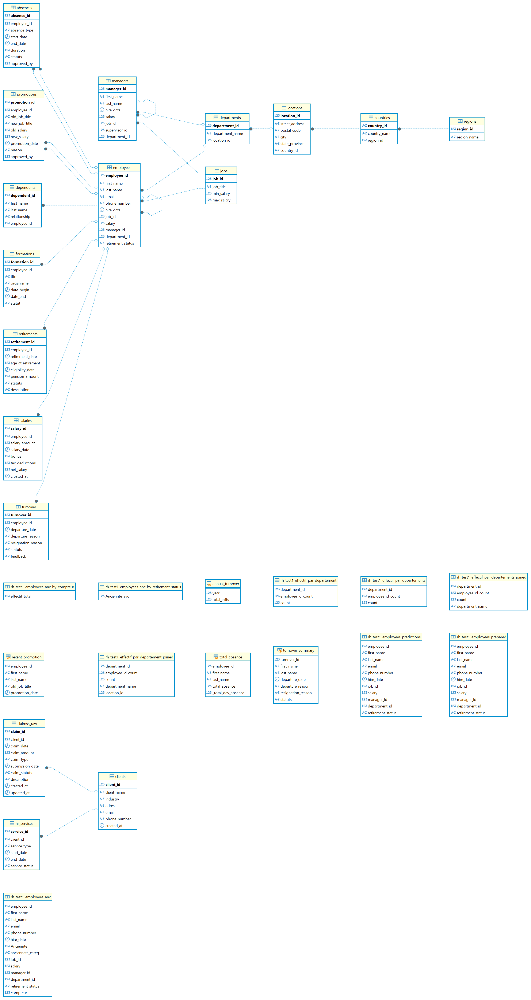

# 👔 Base de Données RH

## 🧾 Description  
Cette base de données modélise de manière complète les processus liés aux Ressources Humaines. Elle permet de centraliser les données des employés, leur parcours professionnel, les services RH, ainsi que les indicateurs clés comme le turnover, la formation ou encore les absences. Elle est conçue pour répondre aux besoins stratégiques et opérationnels du service RH.

## 🗂️ Tables principales

| Table                   | Description                                 |
|------------------------|---------------------------------------------|
| `employees`            | Données personnelles et professionnelles des employés |
| `jobs`                 | Détails des postes, salaires min/max        |
| `departments`          | Structure organisationnelle interne         |
| `locations`            | Localisation des départements               |
| `managers`             | Informations sur les superviseurs           |
| `salaries`             | Historique de paie : brut, net, taxes       |
| `absences`             | Historique des absences (type, durée, motif)|
| `promotions`           | Changements de poste et d’évolution salariale |
| `formations`           | Suivi des formations, dates et organismes   |
| `retirements`          | Départs à la retraite, âge, pension         |
| `turnover`             | Départs d’employés, feedback, raisons       |
| `dependents`           | Ayants droit liés à un employé              |
| `clients`              | Entreprises clientes dans un contexte de prestations RH |
| `hr_services`          | Services RH délivrés aux clients            |
| `claims_raw`           | Réclamations ou incidents RH signalés       |
| `regions`, `countries` | Hiérarchie géographique                     |

## 🎯 Besoins Métiers Couvert par la BDD RH

| Besoin RH                      | Objectif Métiers RH                                                       |
|-------------------------------|--------------------------------------------------------------------------|
| 📊 Pilotage RH                | Suivi des effectifs, âge moyen, ancienneté, pyramide des âges            |
| 📈 Analyse du Turnover        | Identifier les causes de départs, calcul du taux de rotation             |
| 💸 Suivi de la masse salariale| Contrôle des coûts RH, prévisions budgétaires                            |
| 📚 Plan de formation          | Suivi des formations réalisées, conformité avec les obligations légales  |
| 🔁 Gestion de carrière        | Historique des promotions, accompagnement des évolutions internes        |
| 👪 Données sociales           | Suivi des ayants droit, conformité avec les obligations sociales         |
| 📍 Répartition géographique   | Localisation des effectifs, multi-sites, reporting local/national        |
| 🧾 Archivage et conformité    | Conformité RGPD, traçabilité RH                                           |

## 🖼️ Schéma relationnel



## 📂 Arborescence du dépôt

```
hr_project/
│
├── script_python/           # Scripts Python pour l'analyse des données RH
├── diagramme/               # Schéma relationnel de la base de données
│   └── hr_sample_diagramme.png
├── README.md                # Présentation du projet RH
└── ...
```

## 📬 Contact

📧 ouizalou@gmail.com  
🐙 [GitHub - ouizalou](https://github.com/ouizalou)

---

🧠 *Projet pédagogique de modélisation RH — librement réutilisable pour des cas pratiques d’analyse ou d’audit RH.*
